# Adversarial Attacks 

Machine learning, in particular deep learning, has progressed exponentially and has allowed machines to perform tasks that far exceed human performance.With the successes of machine learning, it is easy to make the mistake of claiming that ML models are able to *understand* the data. In reality, machine learning, in its current form, is a *pattern recognition* system. This leads to the models having vulnerabilities that can be exploited, rendering them extremely brittle. A whole new subfield in Deep learning has opened up which works towards finding possible attacks and developing full-proof defenses against the adversaries. This field is formally called "Adversarial Machine Learning" and has made important contributions to machine learning security. 
The aim of our blog is to demonstrate 3 contrastingly different adversarial attacks on neural networks, develop an intuition of the how they work and do an analysis of their severity under different settings.
Adversarial attacks can broadly be divided into:
- Poisoning attacks: wherein training data could be poisoned to ensure resultant model mishandles a targeted input
- Evasion attacks: wherein a trained model is fooled by designed inputs
- Exploratory attacks: wherein a trained model is mimicked by attackers

We describe each of them in detail below.

## Poisoning Attacks:

Adversarial poisoning attacks involves the injection of "poisoned" examples in the training set which manipulates the test time performance of a model. These attacks are usually *targeted* i.e. they are done to manipulate the performance of the model on specific test examples. Poisoning attacks only  require an access to the model parameters without the need of other training data. Clean label attacks are a specific type of poisoning attacks that don't require the control of the labelling process while building the train dataset. These attacks look seemingly innocuous and can go unnoticed even by an expert labelling entity. Hence this opens the door for attackers to succeed without any inside access to the data collection/labeling process. An adversary could craft poison examples and leave them online to be scrapped by a data collecting bot. For example, a neural network in a self driving car could be trained with poisoned instances to mis-classify a "STOP sign" to another instuction. 

To demonstrate poisoning attacks we have implemented the paper "Poison Frogs! Targeted Clean-Label Poisoning Attacks on Neural Networks"  by Shafahi et. al [1]. This paper gives a powerful technique to execute Clean-label techniques that don't compromise on the test-time performance and miss-classify only a specific target instance for which the poison examples are crafted. Next we described the approach used in the paper to generate the poisoned data. 

### Executing  Simple Clean Label attacks:
The paper uses a simple approach to craft posion instances. The adversary here has access to the model parameters.  The adversary first selects a base class which is used for generating the malicious examples.  The adversary then selects a target instance which it wants to miss-classify. A base instance is taken from the base class and imperceptible changes are made to this using an optimization based procedure to give rise to the poison instances. The poison instances are assigned the labels of the base class. The model is retrained upon the original training data+ poisoned instances. If the  target is successfully miss-classified to the base class then the poisoning attack is said to be successful. 

#### Crafting Poison instances through feature collisions:

The procedure described above effectively boils down to creating a poison instance such that it perceptually appears to be from the base class while it collides with the target instance in the feature space. By feature space we mean the highest level of features extracted by the classifier just before applying a softmax layer. Let  be the feature space of the model. Hence we want a poison instance **p** from the base class **b** for a target **t** such that:

The first term on the RHS forces the features of the poisoning instance to collide with the features of the target and the second term forces the poisoning instance to be closer to the base class perceptually.  decides which term dominates in the objective. Now the poison instance labelled as the base class is located extremely close to the target instance in the feature space.  Hence training over the poisoning instances will inadvertently cause the linear decision boundary to cross over the target instance and indvertently classify it as the base class. Hence this gives an adversary a *backdoor* into the model. 

#### Algorithm for crafting poison instances

Following is a iterative procedure to optimize the objective given previously:

---
**Input**target instance **t**, base class **b**,  learning rate 

**Initialize** x:   

Define 

for i in 1 to total_iterations:

&nbsp;&nbsp;&nbsp;&nbsp;&nbsp;&nbsp;Forward Step: 

&nbsp;&nbsp;&nbsp;&nbsp;&nbsp;&nbsp;Backward Step: 

end for

Watermark x with t

---

The fowards step essentially causes a feature collision between the target and the poison instance. The forward step reduces the Frobenius distance between the poison instance and base class. Tuning  influences how close the posioned instance looks to the base instance. Watermarking is used to strengthen the attacks. 

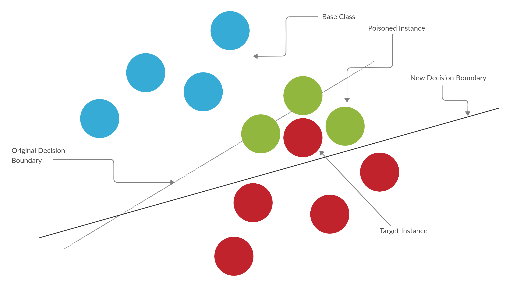

<em>Decision boundary rotation in a clean label attack</em>

### One Shot Kill attacks on Transfer Learning tasks

Transfer learning tasks are extremely vulnerable to clean label attacks. Infact even a single poisoned instance is capable of breaking the neural network during test time. It is common to use pre-trained networks as feature extractors with additonal layers added for a task. Popular architectures are used as pretrained networks and an adversary may have easy access to the model parameters. Here we use the CNN of  **Alex-Net** as a feature extractor and it is frozen during training. The dense network of Alex-Net is discarded.

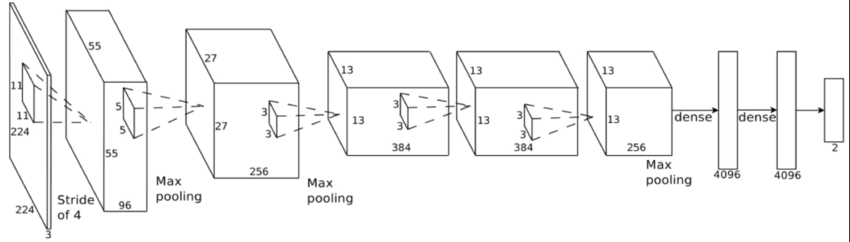

<em>Alex-Net Architecture, We retain only the CNN portion</em>

A final layer is added and is the only trainable part of the model. The model is trained to classify between instances of airplanes and automobiles. We use 800 training images (having equal number of airplanes and automobiles) and 100 test images. Automobiles are chosen as the base class and a particular instance is used as the base instance. We run the iterative optimization algorithm twice for every test instance, with and without the watermarking step. Our hyperparameters are set as follows:

, Opacity for Watermarking =0.15, Total iterations = 1000
 
 We obtain the following results:

 Success rate without watermarking = 61%

 Success rate with watermarking = 96%

The performance of the classifier is not compromised while injecting poison instances. The classification accuracy difference before and after poisoning is negligible and hence these attacks can go easily unnoticed. 
Test accuracy of the classifier before poisoning = 97.4%
Average test accuracy of the classifier after poisoning = 97.1%

Hence watermarking increases the intensity of the attacks. Moreover the task is done only over a single poisoned instance and multiple instances can further exacerbate the severity of the attacks. We show diferent examples of the base, target and poisoned instances below. Note how seemingly innocuous the poison instances look and can never be suspected upon by an expert labeller. 

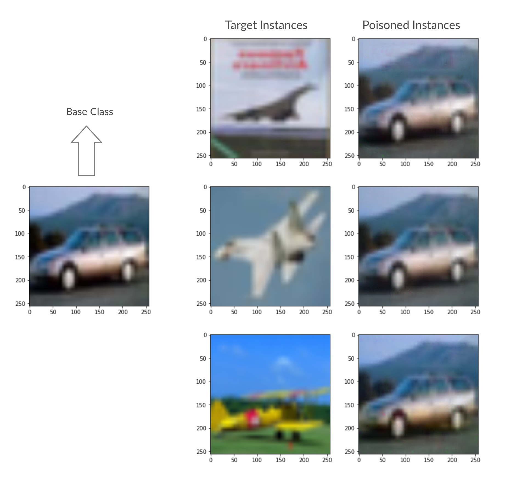

<em>Base, Target and Poisoned Instances in a one shot kill attack</em>

### Poisoning attacks on end-to-end Training 
We investigate the effectiveness of the attacks in an end to end training scenario. For this we use a custom CNN architecture. The architecture has 2 conv layers and 2 fully connected layers and is shown below:

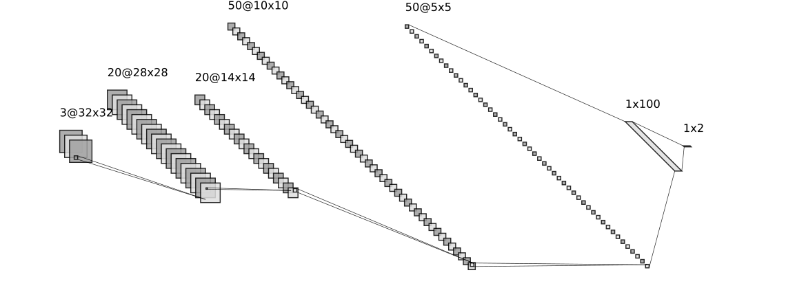

<em>Architecture used for end to end training</em>

Unlike the previous case the feature extraction kernels weren't frozen. Initially the network was trained on the same dataset used in transfer learning. A target instance was picked and poison instances were generated using the iterative procedure. The model was retrained end to end on the poisoning instances + original train dataset.  Unlike the previous case where a single instance was used, here we generate 20 poison instances for a target instance.  Watermarking is used for every poison instance.
Our hyperparameters are set as follows:

, Opacity for Watermarking =0.2, Total iterations = 1000

Test accuracy of the classifier before poisoning = 92.4%

Average test accuracy of the classifier after poisoning = 87.5%

We obtain a success rate of 43% even with the watermarking. Shown below  is an example of a target instance and some of its poisoning instances. Again the poisoned examples have imperceptible changes from their base class. 

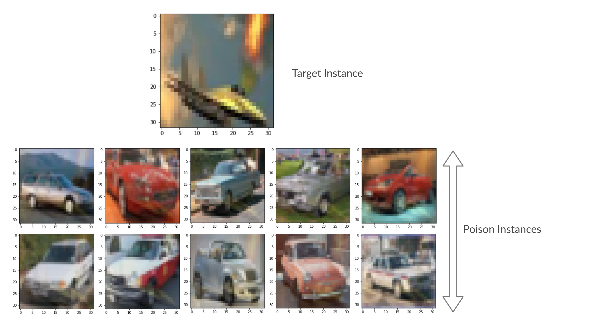

<em>Poisoned images for attacks on end to end training</em>

 
Poisoning attacks on end to end training are much more difficult to execute then on a transfer learning task. The first reason is that poisoning visibly worsens the performance of the classsifier at test time and can be detected. [1] shows that unlike the transfer learning scenario where the final layer decision boundary rotates to accommodate the poison instance within the base region, the decision boundary in the end-to-end training scenario is unchanged after retraining on the poisoned dataset. The observation that can be made is during retraining the lower layers of the network adjust such that the poison instances are projected back to the base class in the higher level feature space. Quoting the paper directly: 

 "*The poison instance generation exploits imperfections in the feature extraction kernels in earlier layers such that the poison instance is placed alongside the target in feature space. When the network is retrained on this poison instance, because it is labeled as a base, those early-layer feature kernel imperfections are corrected and the poison instance is returned to the base class distribution.*" The key to a succesful attack in this scenario is to prevent the separation of the target instance and the poisoning examples during retraining. Watermarking achieves this goal to a certain exent. By blending the features of a target instance with its poisoned example, we bring the poisoned example extremely close to the target.

### Challenges 

The major challenged faced by us while implementing this attack was tuning the hyperparameter for generating posioned instance. One configuration doesn't fit all the base instances. A higher  can make the poisoned instance resemble the base class but can seperate the target and poison instance in the feature space. On the other hand a hihger learning rate will give good feature collisions but the poisoned instance will look nothing like the base class and hence can be easily detected. Tuning should be done keeping this tradeoff in mind. 

To conclude the paper shows how flaws in neural networks can be exploited during train time and calls for attention to the important issue of data reliability

All code to implement the attacks can be found [here](https://github.com/SConsul/Adversarial_Attacks/tree/master/Poison_attacks)

## Evasion Attacks: Adversarial Perturbations
The premise of adversarial perturbations is that a small, visually imperceptible perturbation can be added to a model input that fools the model. This has worrying implications in this age where deep learning is being relied for critical tasks such as self-driving cars and in security systems like facial recognition. We describe 2 white-box attacks (i.e. the attacker has access to the gradient information) that easily breaks state of the art networks.

### FGSM: Fast Gradient Sign Method
The idea behind FGSM is very simple. For a classification task, shifting the input along the direction of the gradient of the cost function w.r.t input with a large enough step will shift the datapoint across the decision boundary and be misclassified by the network.

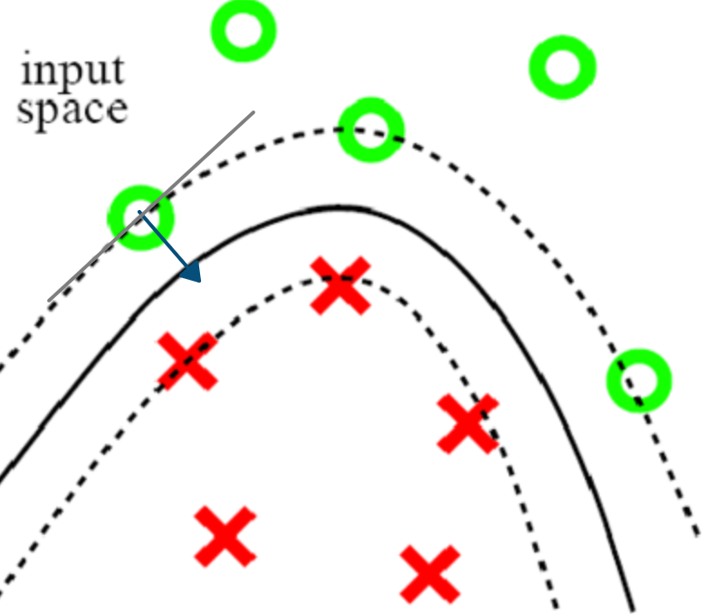

This is basically a single gradient ascent step with the perturbation step = ε. There is a trade off between drop in performance and perceptibility of the perturbation. 

The salient features of FGSM are:
- Extremely fast
- No training required
- ε has to be picked to trade-off between accuracy reduction and perceptibilty of the perturbation. 

### Results: Attacking LeNet trained on MNIST
Applying the FGSM attack on a pretrained MNIST classifier with a LeNet architecture:
we get the following results:

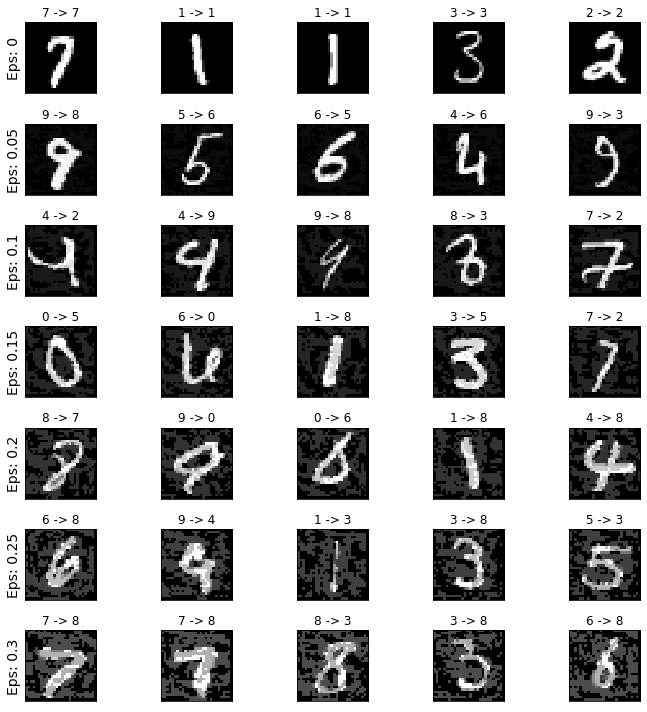

| Epsilon | Accuracy |  
|:-------:|:--------:|
|    0    |   0.981  |   
|   0.05  |  0.9426  |   
|   0.1   |  0.8510  |
|   0.15  |  0.6826  |   
|   0.2   |  0.4301  |   
|   0.25  |  0.2082  |   
|   0.3   |  0.0869  |   

On datasets like ImageNet, FGSM has been shown to be able to generate visually imperceptible perturbations while breaking the state of the art models to almost 0% accuracy.

### PGD: Projected Gradient Descent
The Projected Gradient Descent method follows the same logic as FGSM, but lifts the constraint of a single step update. The attacker has no restriction in time to best attack which can be described as a *constrained optimization problem.* PGD maximizes the model loss, with the constraint that the perturbation is smaller than the specified ε. This is mathematically expressed as:

This ε is to be chosen empirically such that the perturbation is not noticable. At every update, the the step is projected back into the L_p ball around the sample.
The L_p is a technical term to denote the space where all points are within ε distance (p-norm) from the sample. Projection of a point, z, into the L_p ball is simply finding the nearest point to z in the L_p ball.

The PGD attack can be targeted (create confusion amongst specific labels) or untargeted (simply misclassify inputs). The algorithm is described as follows:
1. Start from anywhere within L_p Ball around sample, X
2. [UNTARGETED] Take gradient step along direction of max gradient of Loss(X,Y)
   [TARGETED] Take gradient step along in the negative direction of max gradient of Loss(X,Y_targeted)
3. Project step back into L_p Ball
4. Repeat steps 2,3

### Results: Attacking LeNet trained on MNIST

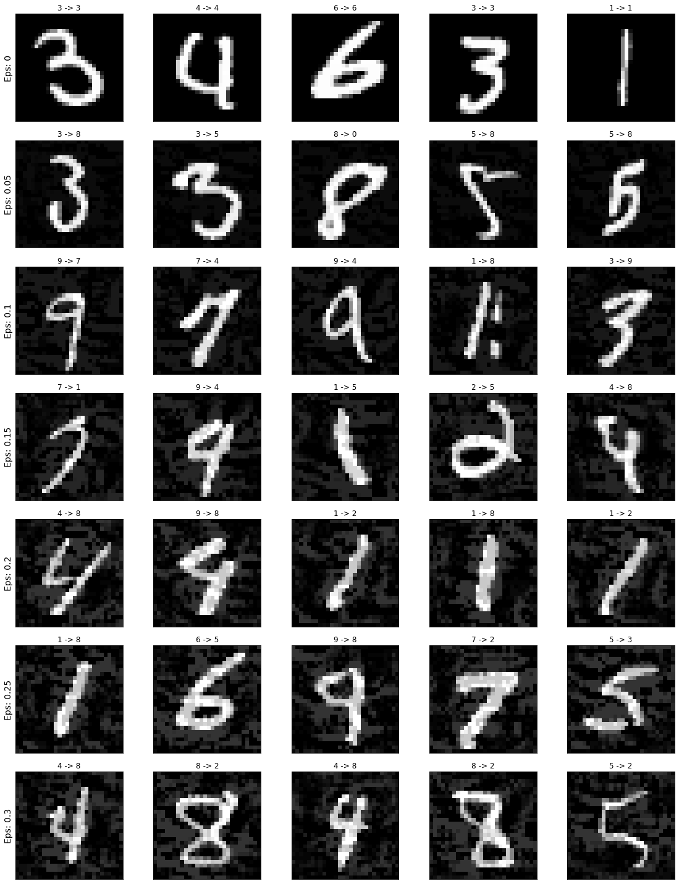

| Epsilon | Accuracy |  
|:-------:|:--------:|
|    0    |   0.981  |   
|   0.05  |  0.9295  |   
|   0.1   |  0.7637  |
|   0.15  |  0.4555  |   
|   0.2   |  0.1806  |   
|   0.25  |  0.1806  |   
|   0.3   |  0.0869  |   

## Exploratory Attacks

Exploratory attacks happen after a model has been trained and is up and running. The aim of the attacker is to query the model and hence gain some information so as to train his own model to closely approximate the target model. For companies that provide ML-based services, this presents a tradeoff between the secrecy and the "explainibility" of the model. That is, for the assurance of proper feature selection, the companies need to disclose some metrics which can explain how the input of a model affects the output. However, revealing this information can quite often compromise the secrecy of the model, thus posing a danger to the companies intellectual property.

Apart from this, if an accurate copy of a model is gotten hold of by an adversary, he can probe his own model for weaknesses and thus infer the same about the target. This can reduce the accuracy of the target over time as more and more adversaries get to know about the model's weaknesses.

The metrics that companies give out for model comprehension often involves some heuristic or a function of the gradient of the output with respect to the input. These heuristics (called saliency maps) are what expose this model to exploratory attacks.

### Problem Model 

We assume in this project that the adversary has access to two kinds of queries :
1. Membership queries
2. Gradient queries (The gradient of the output of the model with respect to the input)

We work on a classifier trained on the MNIST dataset.

Based on the information obtained in response to the above queries, we train a 2 layer model that would seek to approximate the trained target classifier.

### Membership query attack

In this type of attack, we query the target on limited number of images picked from training data. Based on the response obtained, we train our neural network directly using stochastic gradient descent.

In the case of training an MNIST classifier, we used cross entropy loss with a learning rate = 0.001 and momentum parameter set to 0.9. the number of training images that we assumed the attacker has access to was 10000 as opposed to the 60000 that were used to train the target.

### Gradient query attack

In this type of attack, we query the target on limited number of images picked from training data for both the output and its gradient. Based on the response obtained, we train our neural network directly using stochastic gradient descent.

In the case of training an MNIST classifier, we used cross entropy loss with an additional term. This additional term was MeanSquareError(Grad(Target(x)), Grad(AttackerNeuralNet(x))). We took the learning rate to be 0.001 and momentum parameter to be 0.9. the number of training images that we assumed the attcker has access to was 10000 as opposed to the 60000 that were used to train the target.

### Implementation and results

1. Target Models : FCNN and CNN trained on the MNIST dataset

2. Attacker Models : Two layer ReLU + Softmax neural network

3. Maximum number of queries allowed : 10000

#### Results with queries from training data :

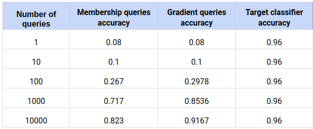

Table 1 : Number of queries vs Accuracy

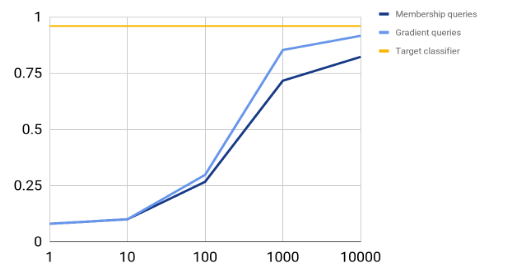

Graph 1 : Number of queries vs Accuracy

#### Results with queries chosen from Gaussian distrbution :

It may be that the attacker does not have any access to the training data of the target model. He therefore queries on images chosen randomly from a Gaussian distribution with appropriate mean and variance. The results for this type of an attacker model are given below.

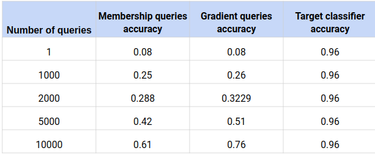

Table 2 : Number of queries vs Accuracy

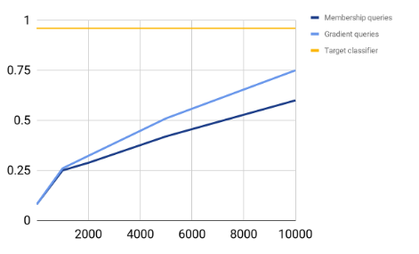

Graph 2 : Number of queries vs Accuracy

### Conclusion and defenses

Thus, we see that even without access to the training data of a model, an attacker can estimate a model well through just gradient queries.

Because querying is the way a company provides an ML-based service, there is no real defense for this attack. The only precaution might be to limit the amount of gradient based information provided or encode the gradient information in a way that is provides a comprehension of the model as well as making it difficult for attackers to backtrack and work out the details of the gradient value itself.   

## References

[1] [Poison Frogs! Targeted Clean-Label Poisoning Attacks on Neural Networks” by Shafahi et. al at NeurIPS 2018](https://papers.nips.cc/paper/7849-poison-frogs-targeted-clean-label-poisoning-attacks-on-neural-networks.pdf)

[2]  [Ian J. Goodfellow, Jonathon Shlens, and Christian Szegedy.  Explaining and harnessing adversarial examples, 2014](https://arxiv.org/abs/1412.6572)

[3] [Aleksander Madry, Aleksandar Makelov, Ludwig Schmidt, Dimitris Tsipras, and Adrian Vladu. Towards deep learning models resistant to adversarial attacks, 2017](https://arxiv.org/abs/1706.06083)

[4] [Model Reconstruction from Model Explanations - Smitha Milli, Ludwig Schmidt, Anca D. Dragan, Moritz Hardt - 2018](https://arxiv.org/abs/1807.05185)

 

